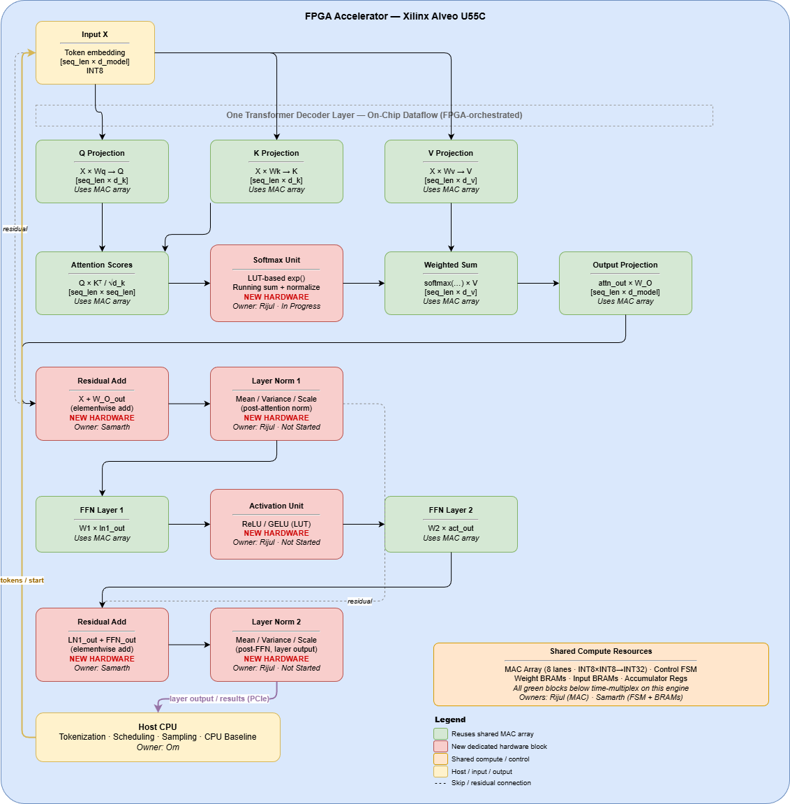

# Low-Precision FPGA Transformer Accelerator

> A hardware accelerator for Transformer FFN computation using a parallel INT8 MAC array on the Xilinx Alveo U55C.

---

## Project Overview

We are building a **low-precision hardware accelerator for Transformer-based inference** on an FPGA.

**Core computation:**
```
y = W2 * ReLU(W1 * x)
```

This is implemented as a high-performance dot-product / matrix multiplication engine using:
- INT8 weights and activations
- INT32 accumulation
- 8-lane parallel MAC array (output-stationary)

---

## Platform

| Property | Value |
|---|---|
| FPGA Board | Xilinx Alveo U55C (PCIe accelerator) |
| Host Interface | PCIe via XRT |
| Target Dimensions | N=64, K=64 (TinyLlama-derived) |
| Compute Core | 1D Parallel MAC Array |
| Precision | INT8 × INT8 → INT32 |

---

## Team

| Person | Role |
|---|---|
| **Satyarth** | Model, Quantization & Ground Truth — `model.py`, test data |
| **Rijul** | MAC Unit & Parallel Compute Core — `mac_unit.v`, `mac_array.v` |
| **Samarth** | Dataflow, Tiling & Control — `control_fsm.v`, BRAM interface |
| **Om** | U55C Integration & Host Interface — host program, PCIe kernel |

---

## Repository Structure

```
Project/
  README.md                  ← this file
  docs/
    block_diagram.md         ← system block diagram explanation with signal tables
    Milestone2.pdf           ← milestone specification
    Milestone2.png           ← system architecture diagram
  rtl/
    control_fsm.v            ← (WIP) tiling FSM and dataflow control
    tb_control_fsm.v         ← (WIP) FSM testbench
```

---

## System Architecture



For full details — signal tables, FSM state diagram, tiling strategy, and cycle trace — see [docs/block_diagram.md](docs/block_diagram.md).

---

## 4-Week Execution Plan

### Week 1 — Foundations
- Python FFN model + INT8 quantized test data (Satyarth)
- MAC unit + 8-lane MAC array in Verilog (Rijul)
- Block diagram, FSM design, tiling plan (Samarth)
- U55C environment setup + host communication (Om)

### Week 2 — FPGA Compute Integration
- MAC array integrated with control FSM
- Tiled matrix multiplication in simulation
- BRAM buffers for inputs and weights

### Week 3 — Memory & Performance
- Tiled weight streaming
- Double buffering (ping-pong BRAM)
- Performance measurement and resource utilization

### Week 4 — Optimization & Finalization
- Performance comparison vs CPU
- Bottleneck analysis
- Final demo and report

---

## Success Criteria

- Working INT8 MAC array on FPGA
- Host → FPGA → Host data pipeline
- Accelerated linear layer execution
- Measured speedup vs CPU baseline

---

## Key Constraints

- **Not** implementing full TinyLlama — it is used only as a reference for dimensions
- **Not** implementing sparsity, attention, or KV cache (Phase 1)
- **Not** using a 2D systolic array — 1D parallel MAC array is the chosen architecture
- 4-week hard deadline: prioritize a working vertical slice over completeness
