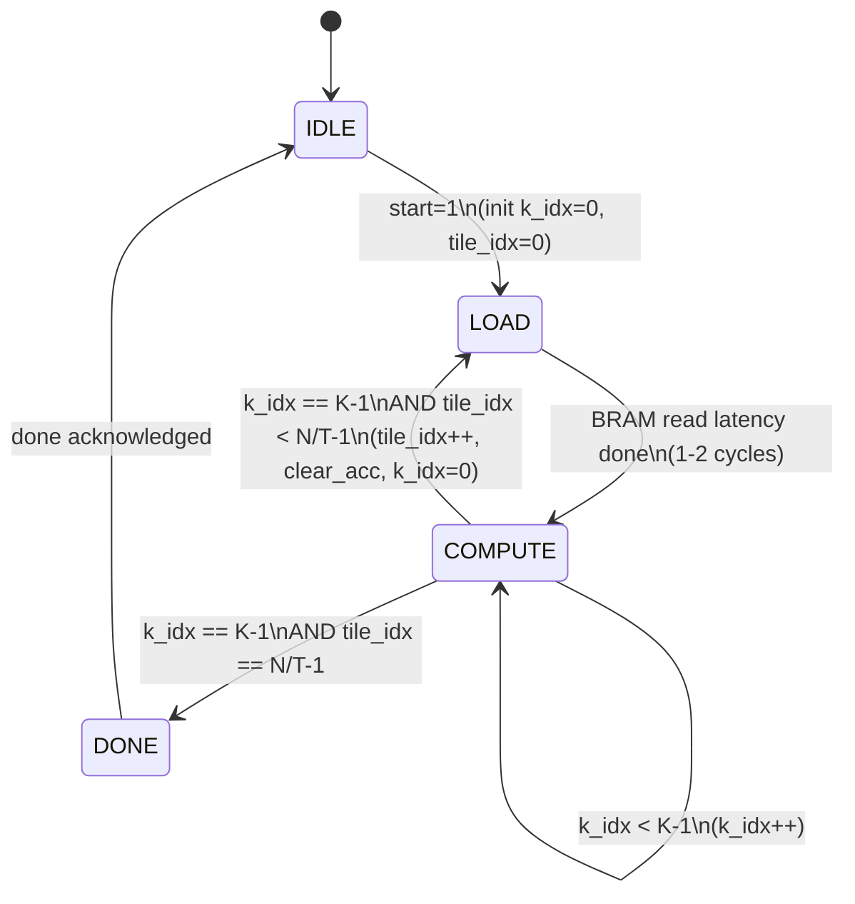

# Dataflow & Control Block Diagram
## Samarth – DATAFLOW, TILING, AND CONTROL

> Visual diagram: open `block_diagram.drawio` with the Draw.io Integration VS Code extension.

---

## FSM State Diagram



---

## Block-by-Block Description

---

### Host CPU — *Om*
The outside world. Sits outside the FPGA boundary and communicates over PCIe.

| Direction | Signal | Width | Description |
|---|---|---|---|
| OUT → FSM | `start` | 1 | Pulses high to begin computation. FSM transitions IDLE → LOAD. |
| IN ← FSM | `done` | 1 | FSM asserts high when all tiles are complete. Host reads output buffer. |
| IN ← Output Buffer | `results (PCIe)` | 64×32b | The completed output vector y[0..N-1] transferred back to host. |

---

### Input Vector BRAM — *Samarth (instantiation & control) · Satyarth (data)*
Stores the input vector **x** — 64 INT8 values loaded by the host before `start`.
Each cycle during COMPUTE, the FSM provides an address and the BRAM outputs one value that is **broadcast identically to all 8 MAC lanes**.

| Direction | Signal | Width | Description |
|---|---|---|---|
| IN ← FSM | `k_idx` (rd_addr) | 7b | Read address. Selects which element x[k] to output this cycle. |
| OUT → MAC Array | `x[k]` | 8b INT8 | The current input element. Sent to all 8 lanes simultaneously (broadcast). |

---

### Weight Tile BRAM — *Samarth (instantiation & control) · Satyarth (data)*
Stores one **tile** of weight matrix W at a time — 8 rows × K columns = 512 INT8 values.
Each row maps to one MAC lane. After each tile finishes, the next 8 rows are loaded.

| Direction | Signal | Width | Description |
|---|---|---|---|
| IN ← FSM | `tile_idx + k_idx` (rd_addr) | 10b | Read address. Encodes both which tile (row group) and which column (k step). |
| OUT → MAC Array | `W[j,k] × 8 lanes` | 8×8b INT8 | One weight value per lane, all read in parallel each cycle. |

---

### Control FSM — *Samarth*
The brain of the accelerator. Runs a two-level loop and generates every control signal that drives the other blocks. Contains two counters: `k_idx` (inner loop) and `tile_idx` (outer loop).

| Direction | Signal | Width | Description |
|---|---|---|---|
| IN ← Host | `start` | 1 | Triggers computation. FSM leaves IDLE state. |
| OUT → Input BRAM | `k_idx` | 7b | Inner loop counter, 0→K-1. Acts as the BRAM read address for x. |
| OUT → Weight BRAM | `tile_idx + k_idx` | 10b | Combined address: selects correct weight row and column each cycle. |
| OUT → MAC Array | `mac_valid` | 1 | High every COMPUTE cycle. Tells MAC array to accumulate this cycle's inputs. Low during LOAD. |
| OUT → Accumulators | `clear_acc` | 1 | Pulsed high once at the start of each new tile. Resets all 8 INT32 regs to 0. |
| OUT → Host | `done` | 1 | Asserted after the last tile completes. Signals host to read results. |

---

### MAC Array (8 Lanes) — *Rijul*
The actual compute engine. 8 lanes run fully in parallel each cycle.
Each lane performs: `acc[j] += W[j,k] × x[k]` (INT8 × INT8 → INT32).

| Direction | Signal | Width | Description |
|---|---|---|---|
| IN ← Input BRAM | `x[k]` | 8b INT8 | Single value, broadcast to all 8 lanes. Every lane multiplies by the same x[k]. |
| IN ← Weight BRAM | `W[j,k] × 8` | 8×8b INT8 | One weight per lane. Lane j uses W[j,k], its own unique weight. |
| IN ← FSM | `mac_valid` | 1 | Gate signal. MAC only accumulates when this is high. |
| OUT → Accumulators | `partial sums` | 8×32b INT32 | Running multiply-accumulate result flowing into the accumulator registers each cycle. |

---

### Accumulator Registers — *Rijul*
8 INT32 registers, one per MAC lane. Hold the running dot-product sum across all K=64 steps.
They are **not** reset between k steps — only cleared at tile boundaries via `clear_acc`.

| Direction | Signal | Width | Description |
|---|---|---|---|
| IN ← MAC Array | `partial sums` | 8×32b | Each cycle's MAC output added into the corresponding register. |
| IN ← FSM | `clear_acc` | 1 | Resets all 8 registers to 0. Fired once before each new tile begins. |
| OUT → Output Buffer | `tile results` | 8×32b INT32 | After the K loop finishes, the 8 final sums are written to the output buffer. |

---

### Output Buffer — *Samarth (write side) · Om (read/PCIe side)*
64 INT32 slots — one for every output element y[0..N-1].
After each tile, 8 values are written into the correct slot range (`tile_idx×8` to `tile_idx×8+7`).
After all 8 tiles, the buffer holds the complete result vector.

| Direction | Signal | Width | Description |
|---|---|---|---|
| IN ← Accumulators | `tile results` | 8×32b INT32 | Filled 8 slots at a time after each tile's K loop completes. |
| OUT → Host | `results (PCIe)` | 64×32b INT32 | Full output vector y transferred back to the host after `done` is asserted. |

---

## Tiling Strategy

```
Output dimension  N = 64   (rows of W1 or W2)
Input dimension   K = 64   (cols of W, length of x)
Tile size         T = 8    (MAC lanes = outputs computed in parallel)

Number of tiles = N / T = 64 / 8 = 8 tiles

For each tile (tile_idx = 0 .. 7):
    Load W rows [tile_idx*8 .. tile_idx*8 + 7] into Weight BRAM
    clear_acc = 1  (reset accumulators)
    For each k (k_idx = 0 .. 63):
        x[k]    = InputBRAM[ k_idx ]
        W[j,k]  = WeightBRAM[ j*K + k_idx ]   for j = 0..7
        mac_valid = 1
        All 8 lanes: acc[j] += W[j,k] * x[k]
    Write acc[0..7] → OutputBuffer[ tile_idx*8 .. tile_idx*8+7 ]

Total MAC operations = N × K = 64 × 64 = 4096
Per tile             = 8 lanes × 64 k-steps = 512 MACs in 64 cycles
```

---

## Memory Layout

```
Input Vector BRAM  (x):
  Depth = 64,  Width = 8 bits
  Address 0..63  →  x[0]..x[63]

Weight Tile BRAM  (one tile at a time):
  Depth = 8 × 64 = 512,  Width = 8 bits
  Address = lane*K + k   →  W[tile_idx*8 + lane, k]
  Reloaded from host/DDR for each new tile

Output Buffer:
  Depth = 64,  Width = 32 bits
  Address = tile_idx*8 + lane  →  y[tile_idx*8 + lane]
```

---

## One Full Cycle of Operation

```
1. Host loads x, W1 into BRAMs
2. Host asserts start=1

3. FSM: IDLE → LOAD
   - k_idx = 0, tile_idx = 0
   - clear_acc = 1  (zero the 8 accumulators)

4. FSM: LOAD → COMPUTE  (after 1-2 cycle BRAM read latency)

5. For tile_idx = 0 to 7:
     For k_idx = 0 to 63:
       - Input BRAM outputs x[k_idx]            → broadcast to all 8 lanes
       - Weight BRAM outputs W[j, k_idx] × 8    → one per lane
       - mac_valid = 1
       - All 8 lanes accumulate: acc[j] += W[j,k] * x[k]
       - k_idx++

     - Write acc[0..7] to OutputBuffer[tile_idx*8 .. tile_idx*8+7]
     - clear_acc = 1
     - tile_idx++
     - FSM: COMPUTE → LOAD (next tile)

6. After tile_idx == 7, k_idx == 63:
   - FSM: COMPUTE → DONE
   - done = 1

7. Host reads 64 × INT32 results from Output Buffer over PCIe
```