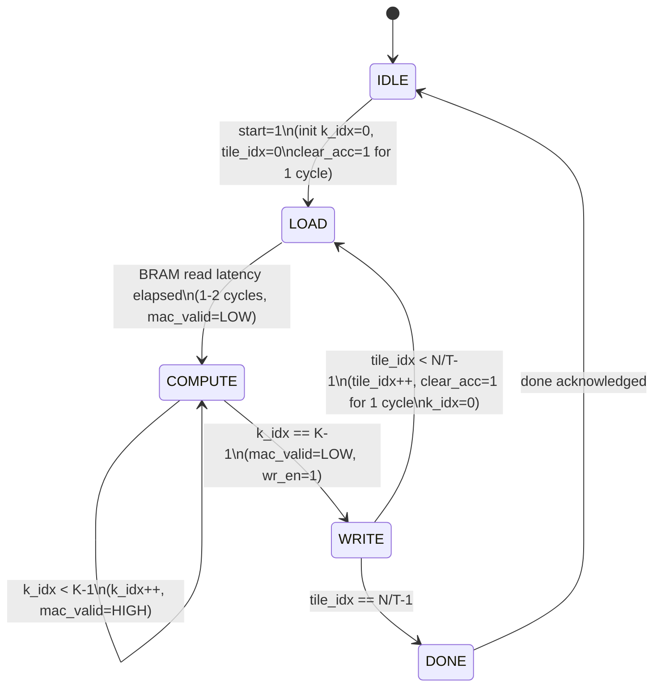

# Dataflow & Control Block Diagram
## Samarth – DATAFLOW, TILING, AND CONTROL

> Visual diagram: open `block_diagram.drawio` with the Draw.io Integration VS Code extension.

> **Scope note (2026-04-06):** This document covers two levels:
> - **Section 1 (GEMM Engine)** — the shared MAC array and its tiling FSM. This is fully implemented and verified.
> - **Section 2 (Full Transformer Pipeline)** — signal tables and dataflow for the complete on-chip decoder layer. Conservative design decisions are recorded in `docs/design_decisions.txt`.

---

## Section 2 — Full Transformer Decoder Layer Pipeline

### Pipeline Overview

```
Host CPU (x86)
     |  PCIe / XRT
     v
FPGA Boundary
     |
     +-- Input Buffer (x: d_model x 1, INT8) ---------------+
     |                                                        |
     |   [GEMM 1: Q Projection]  x * WQ  → Q (d_k x 1)     |
     |   [GEMM 2: K Projection]  x * WK  → K (d_k x 1)     |
     |   [GEMM 3: V Projection]  x * WV  → V (d_v x 1)     |
     |                                                        |
     |   [Attention Score]       Q·K / sqrt(d_k) → scalar   |
     |   [Softmax]               softmax(score) → weight     |
     |   [Weighted Sum]          weight × V → attn_out       |
     |                                                        |
     |   [GEMM 4: W_O Proj]     attn_out * WO → proj_out    |
     |   [Residual Add 1]        x + proj_out → r1           |
     |   [Layer Norm 1]          LayerNorm(r1) → ln1_out     |
     |                                                        |
     |   [GEMM 5: FFN W1]       ln1_out * W1 → h (d_ff x 1)|
     |   [Activation]            ReLU(h) → h_act             |
     |   [GEMM 6: FFN W2]       h_act * W2 → ffn_out        |
     |   [Residual Add 2]        ln1_out + ffn_out → r2      |
     |   [Layer Norm 2]          LayerNorm(r2) → output      |
     |                                                        |
     +-- Output Buffer (y: d_model x 1, INT8) ---------------+
     |
     v  PCIe / XRT
Host CPU
```

**Conservative assumptions (see design_decisions.txt for full rationale):**
- `seq_len = 1` (single token — autoregressive decode)
- `d_model = 64`, `d_ff = 256`, single attention head
- All GEMM inputs are INT8; all GEMM outputs are INT32
- INT32 → INT8 re-quantization (static scales) between GEMM output and next GEMM input
- Host-side pipeline sequencer (Option A): host issues `start` per GEMM step and loads buffers between steps

---

### Pipeline Step Signal Tables

Conservative decisions applied: INT32 outputs from MAC array, INT8 inputs to each GEMM.
`done` is the existing FSM output. `start` is the existing FSM input. Shared MAC array
is re-invoked for each GEMM step with different weights loaded into Weight BRAM.

---

#### Input Buffer  *(Host → FPGA)*

| Direction | Signal | Width | Description |
|---|---|---|---|
| IN ← Host (PCIe) | `wr_en` | 1 | Write enable from XRT kernel |
| IN ← Host (PCIe) | `wr_addr` | 7b | Byte address into input buffer |
| IN ← Host (PCIe) | `wr_data` | 8b INT8 | Input token embedding x[0..d_model-1] |
| OUT → Shared MAC Array | `x[k]` | 8b INT8 | Broadcast to all 8 MAC lanes during COMPUTE |

---

#### Shared MAC Array + Control FSM  *(Samarth + Rijul)*

Re-invoked for each of the 8 GEMM steps. Host loads the correct weight tile into
Weight BRAM and asserts `start` before each invocation.

| Direction | Signal | Width | Description |
|---|---|---|---|
| IN ← Host | `start` | 1 | Begin GEMM. FSM leaves IDLE. |
| IN ← Input Buffer | `x[k]` | 8b INT8 | Current input element, broadcast to all 8 lanes |
| IN ← Weight BRAM | `W[j,k] × 8` | 8×8b INT8 | One weight per lane per cycle |
| OUT → MAC lanes | `mac_valid` | 1 | HIGH only during COMPUTE state |
| OUT → Accumulators | `clear_acc` | 1 | Pulse 1 cycle before each tile COMPUTE |
| OUT → Output Buffer | `wr_en` | 1 | 1-cycle pulse in WRITE state per tile |
| OUT → Output Buffer | `wr_addr` | 4b | Tile index (0..7), selects output slot group |
| OUT → Host | `done` | 1 | 1-cycle pulse after all tiles complete |

---

#### Intermediate Output Buffer  *(between GEMM steps)*

One shared INT32 result buffer (64 × 32b). Re-used across GEMM steps; host or
requantize block reads from it before the next GEMM begins.

| Direction | Signal | Width | Description |
|---|---|---|---|
| IN ← MAC Array | `tile_results` | 8×32b INT32 | 8 accumulator values written per tile |
| IN ← FSM | `wr_en` | 1 | Write enable (1 cycle per tile) |
| IN ← FSM | `wr_addr` | 4b | Tile index for write slot selection |
| OUT → Requantize / Dedicated Block | `y[i]` | 32b INT32 | Full result vector after `done` |

---

#### Re-quantize Block  *(between GEMM output and next GEMM input — Rijul or Samarth)*

Converts INT32 GEMM output to INT8 for the next stage's input BRAM.
Scale values loaded by host before pipeline start.

| Direction | Signal | Width | Description |
|---|---|---|---|
| IN ← Output Buffer | `y_int32[i]` | 32b INT32 | Raw accumulator output |
| IN ← Scale Register | `scale` | 32b FP32 | Per-tensor quantization scale (offline) |
| OUT → Input Buffer (next step) | `y_int8[i]` | 8b INT8 | Clipped/rounded INT8 output |

*Operation: `y_int8 = clamp(round(y_int32 / scale), -128, 127)`*

---

#### Softmax Unit  *(Rijul)*

For `seq_len=1`, softmax of a single score is 1.0 — this block is a passthrough
in Phase 1. Signal table designed for Phase 2 multi-token support.

| Direction | Signal | Width | Description |
|---|---|---|---|
| IN ← Attention Score Buffer | `scores[i]` | 32b INT32 | Raw attention scores Q·Kᵀ/√d_k |
| IN ← Control | `start` | 1 | Begin softmax computation |
| OUT → Weighted Sum | `weights[i]` | 8b INT8 | Normalized attention weights (INT8) |
| OUT → Control | `done` | 1 | Softmax complete |

*Phase 1 (seq_len=1): `weights[0] = 1.0` → output = INT8 max (127), bypass multiply.*

---

#### Activation Unit  *(Rijul)*

Applied to FFN hidden layer (after GEMM 5 / W1 projection).

| Direction | Signal | Width | Description |
|---|---|---|---|
| IN ← Output Buffer | `h[i]` | 32b INT32 | Pre-activation hidden vector (d_ff × 1) |
| IN ← Control | `start` | 1 | Begin activation |
| OUT → Input Buffer (W2 step) | `h_act[i]` | 8b INT8 | ReLU(h), re-quantized to INT8 |
| OUT → Control | `done` | 1 | Activation complete |

*ReLU: `h_act[i] = (h[i] > 0) ? requantize(h[i]) : 0`*

---

#### Residual Adder ×2  *(Samarth)*

Two instances: after attention W_O projection (Add 1), after FFN W2 projection (Add 2).
Inputs are INT32 (zero-extended from INT8), output is INT32 before re-quantization.

| Direction | Signal | Width | Description |
|---|---|---|---|
| IN ← Buffer A | `a[i]` | 32b INT32 | First operand (e.g., original input x) |
| IN ← Buffer B | `b[i]` | 32b INT32 | Second operand (e.g., GEMM projection output) |
| IN ← Control | `start` | 1 | Begin element-wise add |
| IN ← Control | `n` | 7b | Number of elements (d_model = 64) |
| OUT → Output Buffer | `sum[i]` | 32b INT32 | a[i] + b[i], then re-quantize to INT8 |
| OUT → Control | `done` | 1 | Add complete |

---

#### Layer Norm ×2  *(Rijul)*

Two instances: after Residual Add 1 (LN1), after Residual Add 2 (LN2).
Internal FP32 arithmetic; outputs INT8 for next GEMM input.

| Direction | Signal | Width | Description |
|---|---|---|---|
| IN ← Residual Add Output | `x[i]` | 32b INT32 | Input vector to normalize (d_model × 1) |
| IN ← Parameter BRAM | `gamma[i]` | 32b FP32 | Per-element scale parameter |
| IN ← Parameter BRAM | `beta[i]` | 32b FP32 | Per-element shift parameter |
| IN ← Control | `start` | 1 | Begin layer norm |
| OUT → Input Buffer (next step) | `ln_out[i]` | 8b INT8 | Normalized, scaled, shifted, re-quantized |
| OUT → Control | `done` | 1 | Layer norm complete |

*Internal: `ln_out[i] = requantize(gamma[i] * (x[i] - mean) / sqrt(var + eps) + beta[i])`*

---

### Host-Side Pipeline Sequencer (Option A — Phase 1)

The host issues one `start` pulse per GEMM step and one trigger per dedicated block.
Between steps, the host loads the next weight tile and routes buffer pointers.

```
Host loop (pseudocode):
  load_bram(WQ); start_gemm(); wait_done()  → Q in output_buf
  requantize(Q) → input_buf
  load_bram(WK); start_gemm(); wait_done()  → K in output_buf
  requantize(K) → input_buf
  load_bram(WV); start_gemm(); wait_done()  → V in output_buf
  requantize(V) → input_buf
  start_attention_score(Q, K); wait_done()  → score
  start_softmax(score); wait_done()         → weight (=1.0 for seq_len=1)
  weighted_sum(weight, V) → attn_out        → passthrough for seq_len=1
  load_bram(WO); start_gemm(); wait_done()  → proj_out
  start_residual_add(x, proj_out); done()   → r1
  start_layer_norm(r1, LN1_params); done()  → ln1_out
  load_bram(W1); start_gemm(); wait_done()  → h (d_ff x 1)
  start_activation(h); done()              → h_act
  load_bram(W2); start_gemm(); wait_done()  → ffn_out
  start_residual_add(ln1_out, ffn_out); done() → r2
  start_layer_norm(r2, LN2_params); done()  → output
  dma_to_host(output)
```

---

## Section 1 — GEMM Engine (Shared MAC Array)

*(Fully implemented and verified. See control_fsm.sv, mac_array.sv, top.sv.)*

---

## FSM State Diagram



> **Timing notes:**
> - `mac_valid` is HIGH **only** during COMPUTE. It is LOW during LOAD, WRITE, and DONE.
> - `clear_acc` is asserted for **exactly 1 cycle** at the start of IDLE→LOAD and WRITE→LOAD transitions, before COMPUTE begins.
> - LOAD state holds for 1–2 cycles to absorb BRAM read latency before `mac_valid` goes high.

---

## Block-by-Block Description

---

### Host CPU — *Om*
The outside world. Sits outside the FPGA boundary and communicates over PCIe.

| Direction | Signal | Width | Description |
|---|---|---|---|
| OUT → FSM | `start` | 1 | Pulses high to begin computation. FSM transitions IDLE → LOAD. |
| IN ← FSM | `done` | 1 | FSM asserts high when all tiles are complete. Host reads output buffer. |
| IN ← Output Buffer | `results (PCIe)` | 64×32b | The completed output vector y[0..N-1] transferred back to host. |

---

### Input Vector BRAM — *Samarth (instantiation & control) · Satyarth (data)*
Stores the input vector **x** — 64 INT8 values loaded by the host before `start`.
Each cycle during COMPUTE, the FSM provides an address and the BRAM outputs one value that is **broadcast identically to all 8 MAC lanes**.

| Direction | Signal | Width | Description |
|---|---|---|---|
| IN ← FSM | `k_idx` (rd_addr) | 7b | Read address. Selects which element x[k] to output this cycle. |
| OUT → MAC Array | `x[k]` | 8b INT8 | The current input element. Sent to all 8 lanes simultaneously (broadcast). |

---

### Weight Tile BRAM — *Samarth (instantiation & control) · Satyarth (data)*
Stores one **tile** of weight matrix W at a time — 8 rows × K columns = 512 INT8 values.
Each row maps to one MAC lane. After each tile finishes, the next 8 rows are loaded.

> **BRAM Banking (critical):** A standard single-port BRAM cannot supply 8 independent reads per cycle.
> The weight memory must be implemented as **8 separate BRAM banks — one per lane**.
> Each bank stores one row of the tile: lane `j` reads from its own bank at address `k_idx`.
> Option B (later): use a wide BRAM (64-bit) and pack all 8 weights into a single read.

**Within-tile address (current):**
```
rd_addr[j] = j * K + k_idx        (lane j reads its own row at column k)
```

**Full address if all weights are pre-loaded (future / reference):**
```
rd_addr[j] = (tile_idx * T * K) + (j * K) + k_idx
           = tile_idx * 512 + j * 64 + k_idx      (for T=8, K=64)
```
> The current design reloads the BRAM each tile, so only `j * K + k_idx` is needed in hardware.
> The full formula matters if weights are ever pre-loaded globally (e.g., Phase 2 double buffering).

| Direction | Signal | Width | Description |
|---|---|---|---|
| IN ← FSM | `k_idx` (rd_addr per bank) | 7b | Column index into the current tile. Each bank uses the same `k_idx`; lane `j` reads from bank `j`. |
| OUT → MAC Array | `W[j,k] × 8 lanes` | 8×8b INT8 | One weight value per lane, read in parallel from 8 separate banks each cycle. |

---

### Control FSM — *Samarth*
The brain of the accelerator. Runs a two-level loop and generates every control signal that drives the other blocks. Contains two counters: `k_idx` (inner loop) and `tile_idx` (outer loop).

| Direction | Signal | Width | Description |
|---|---|---|---|
| IN ← Host | `start` | 1 | Triggers computation. FSM leaves IDLE state. |
| OUT → Input BRAM | `k_idx` | 7b | Inner loop counter, 0→K-1. Acts as the BRAM read address for x. |
| OUT → Weight BRAM | `k_idx` | 7b | Column index into the current tile. Each of the 8 BRAM banks uses this same address; lane j reads from bank j at `k_idx`. |
| OUT → MAC Array | `mac_valid` | 1 | **HIGH only during COMPUTE state.** LOW during LOAD, WRITE, and DONE. MAC must not accumulate unless this is high. |
| OUT → Accumulators | `clear_acc` | 1 | Pulsed HIGH for **exactly 1 cycle** before COMPUTE begins (on IDLE→LOAD and WRITE→LOAD transitions). Resets all 8 INT32 regs to 0. |
| OUT → Output Buffer | `wr_en` | 1 | Asserted for 1 cycle in the WRITE state (immediately after k_idx == K-1). Triggers write of acc[0..7] into the output buffer at the correct slot. |
| OUT → Host | `done` | 1 | Asserted after the last tile's WRITE state completes. Signals host to read results. |

---

### MAC Array (8 Lanes) — *Rijul*
The actual compute engine. 8 lanes run fully in parallel each cycle.
Each lane performs: `acc[j] += W[j,k] × x[k]` (INT8 × INT8 → INT32).

| Direction | Signal | Width | Description |
|---|---|---|---|
| IN ← Input BRAM | `x[k]` | 8b INT8 | Single value, broadcast to all 8 lanes. Every lane multiplies by the same x[k]. |
| IN ← Weight BRAM | `W[j,k] × 8` | 8×8b INT8 | One weight per lane. Lane j uses W[j,k], its own unique weight. |
| IN ← FSM | `mac_valid` | 1 | Gate signal. MAC only accumulates when this is high. |
| OUT → Accumulators | `partial sums` | 8×32b INT32 | Running multiply-accumulate result flowing into the accumulator registers each cycle. |

---

### Accumulator Registers — *Rijul*
8 INT32 registers, one per MAC lane. Hold the running dot-product sum across all K=64 steps.
They are **not** reset between k steps — only cleared at tile boundaries via `clear_acc`.

| Direction | Signal | Width | Description |
|---|---|---|---|
| IN ← MAC Array | `partial sums` | 8×32b | Each cycle's MAC output added into the corresponding register. |
| IN ← FSM | `clear_acc` | 1 | Resets all 8 registers to 0. Fired once before each new tile begins. |
| OUT → Output Buffer | `tile results` | 8×32b INT32 | After the K loop finishes, the 8 final sums are written to the output buffer. |

---

### Output Buffer — *Samarth (write side) · Om (read/PCIe side)*
64 INT32 slots — one for every output element y[0..N-1].
After each tile, 8 values are written into the correct slot range (`tile_idx×8` to `tile_idx×8+7`).
After all 8 tiles, the buffer holds the complete result vector.

> **Write timing:** The write occurs in the dedicated **WRITE state**, exactly 1 cycle after `k_idx == K-1`.
> The FSM asserts `wr_en=1` and drives the write address `tile_idx * T` for 1 cycle, then transitions to LOAD (or DONE).

| Direction | Signal | Width | Description |
|---|---|---|---|
| IN ← Accumulators | `tile results` | 8×32b INT32 | The 8 final accumulator values captured at the end of the K loop. |
| IN ← FSM | `wr_en` | 1 | Write enable. Asserted for exactly 1 cycle in WRITE state. |
| IN ← FSM | `wr_addr` | 4b | Write address = `tile_idx`. Selects which group of 8 output slots to write into (`tile_idx * 8 .. tile_idx * 8 + 7`). |
| OUT → Host | `results (PCIe)` | 64×32b INT32 | Full output vector y transferred back to the host after `done` is asserted. |

---

## Tiling Strategy

```
Output dimension  N = 64   (rows of W1 or W2)
Input dimension   K = 64   (cols of W, length of x)
Tile size         T = 8    (MAC lanes = outputs computed in parallel)

Number of tiles = N / T = 64 / 8 = 8 tiles

For each tile (tile_idx = 0 .. 7):
    Load W rows [tile_idx*8 .. tile_idx*8 + 7] into Weight BRAM
    clear_acc = 1  (reset accumulators)
    For each k (k_idx = 0 .. 63):
        x[k]    = InputBRAM[ k_idx ]
        W[j,k]  = WeightBRAM[ j*K + k_idx ]   for j = 0..7
        mac_valid = 1
        All 8 lanes: acc[j] += W[j,k] * x[k]
    Write acc[0..7] → OutputBuffer[ tile_idx*8 .. tile_idx*8+7 ]

Total MAC operations = N × K = 64 × 64 = 4096
Per tile             = 8 lanes × 64 k-steps = 512 MACs in 64 cycles
Total cycles         ≈ K × (N/T) = 64 × 8 = 512 cycles  (excluding LOAD latency per tile)
```

---

## Memory Layout

```
Input Vector BRAM  (x):
  Depth = 64,  Width = 8 bits
  Address 0..63  →  x[0]..x[63]

Weight Tile BRAM  (8 banks, one per lane):
  Per bank: Depth = K = 64,  Width = 8 bits
  Bank j stores row j of the current tile: W[tile_idx*8 + j, 0..K-1]
  All banks share the same read address: k_idx
  Reloaded from host/DDR for each new tile

  Within-tile address:   rd_addr[j] = k_idx                (used in hardware)
  Full global address:   rd_addr[j] = tile_idx*T*K + j*K + k_idx  (reference only)

Output Buffer:
  Depth = 64,  Width = 32 bits
  Address = tile_idx*8 + lane  →  y[tile_idx*8 + lane]
```

---

## One Full Cycle of Operation

```
1.  Host loads x into Input Vector BRAM
    Host loads W[tile 0] into 8 Weight BRAM banks (one row per bank)
    Host asserts start=1

2.  FSM: IDLE → LOAD
    - k_idx = 0, tile_idx = 0
    - clear_acc = 1 for exactly 1 cycle  (zero all 8 accumulators)
    - mac_valid = LOW

3.  FSM: LOAD  (hold 1–2 cycles for BRAM read latency)
    - BRAM addresses presented, data not yet valid
    - mac_valid = LOW  (MAC must not accumulate during latency)

4.  FSM: LOAD → COMPUTE  (data now valid on BRAM outputs)

5.  For tile_idx = 0 to 7:

      For k_idx = 0 to 63:
        - Input BRAM[k_idx]     → x[k]        (broadcast to all 8 lanes)
        - Weight Bank j[k_idx]  → W[j,k]      (one per lane, 8 banks in parallel)
        - mac_valid = HIGH
        - All 8 lanes: acc[j] += W[j,k] * x[k]
        - k_idx++

      k_idx == K-1: FSM → WRITE state
        - mac_valid = LOW
        - wr_en = 1  (exactly 1 cycle)
        - wr_addr = tile_idx
        - acc[0..7] written to OutputBuffer[tile_idx*8 .. tile_idx*8+7]

      If tile_idx < 7:  FSM → LOAD (next tile)
        - Host reloads Weight BRAMs with next tile's rows
        - clear_acc = 1 for exactly 1 cycle
        - k_idx = 0, tile_idx++

6.  After tile_idx == 7 WRITE completes:
    - FSM → DONE
    - done = 1

7.  Host reads 64 × INT32 results from Output Buffer over PCIe
```